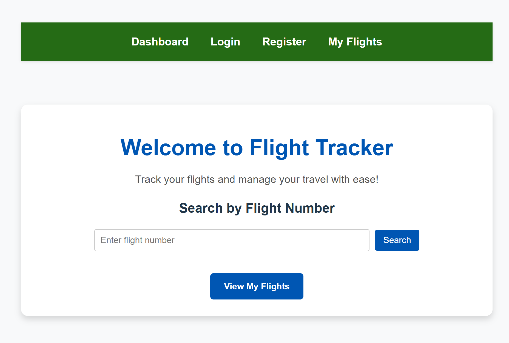
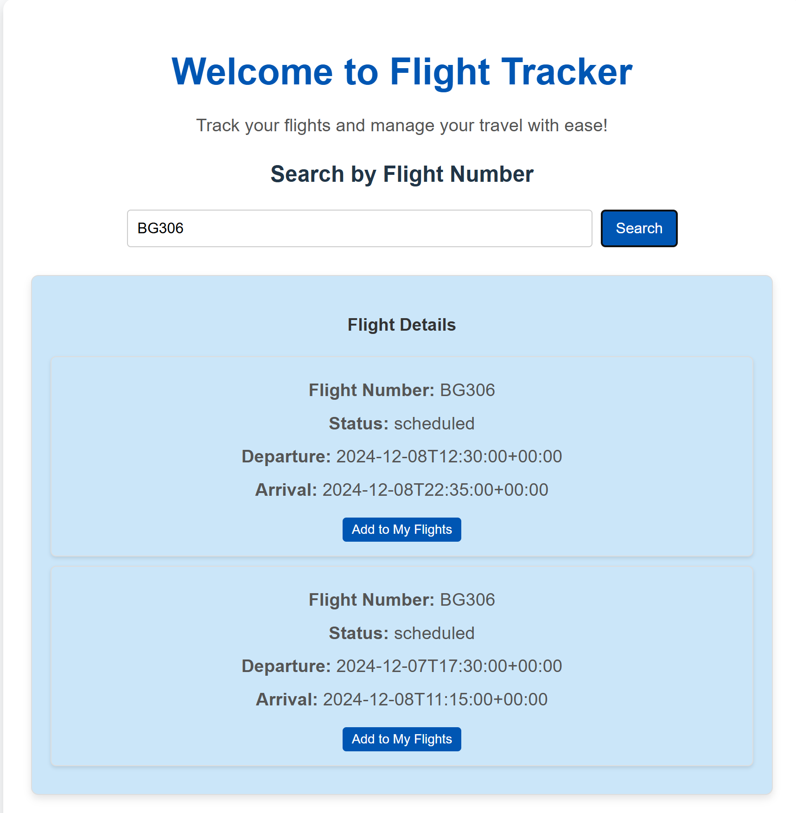
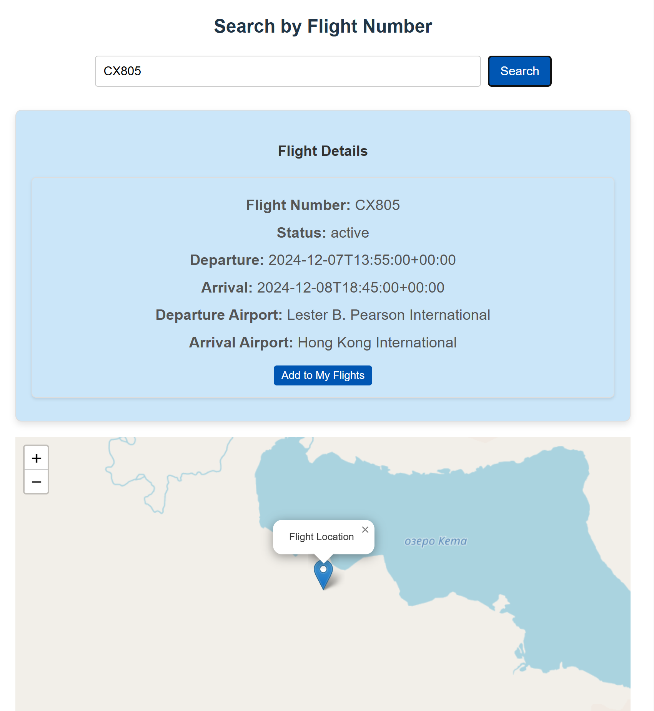
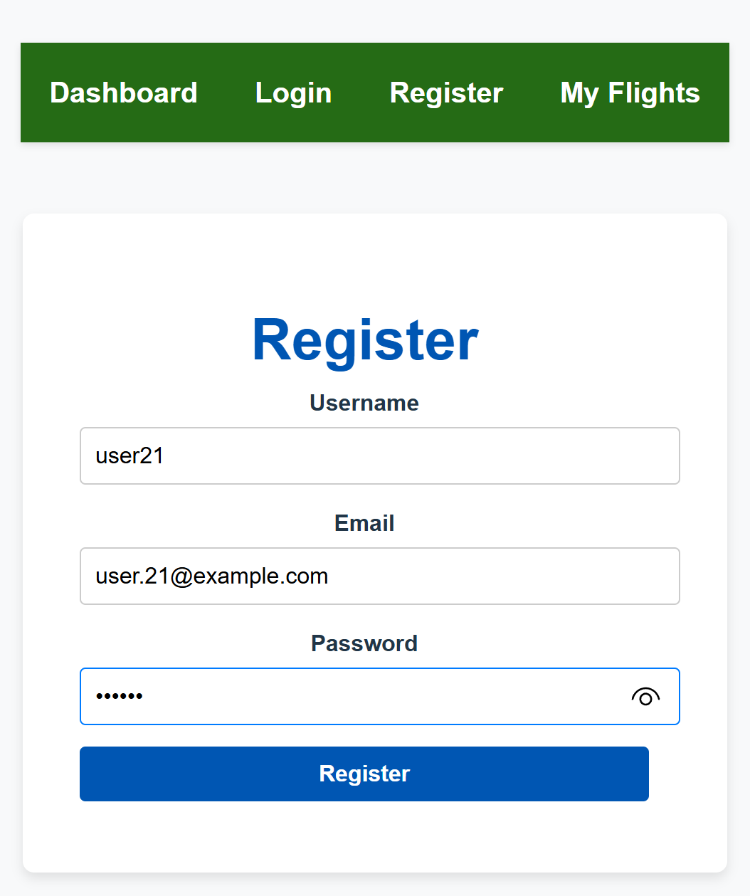
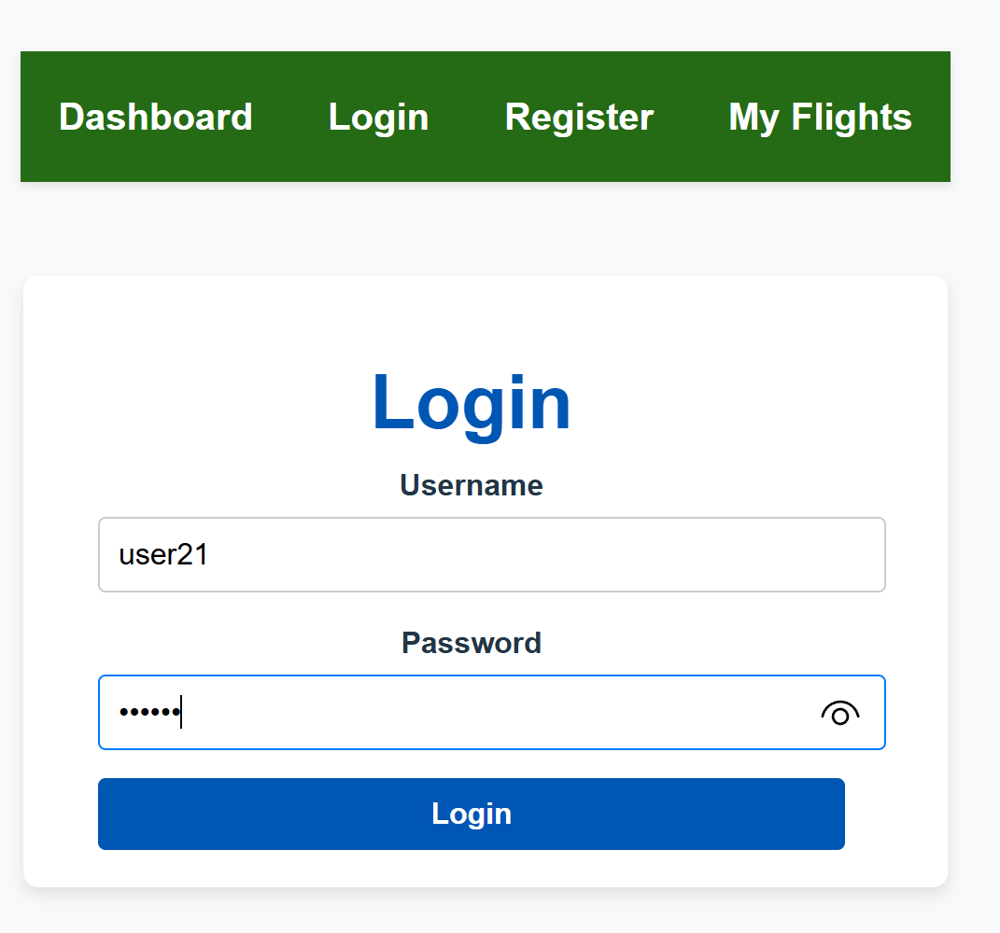
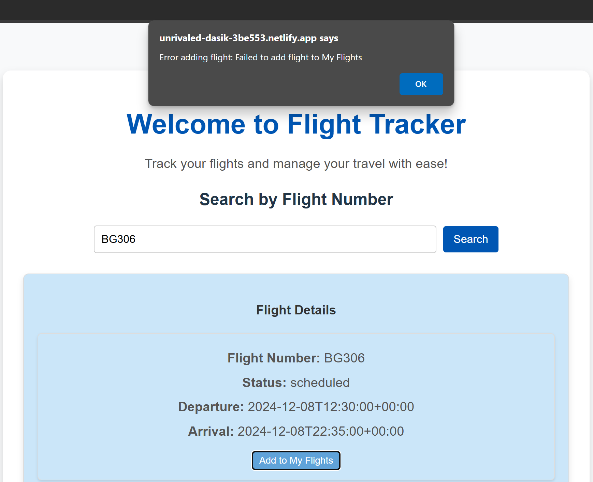
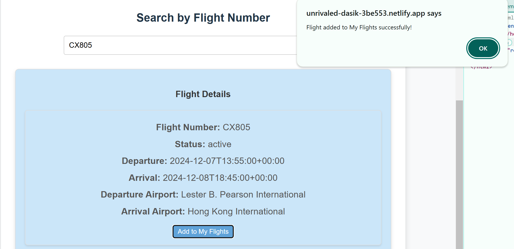
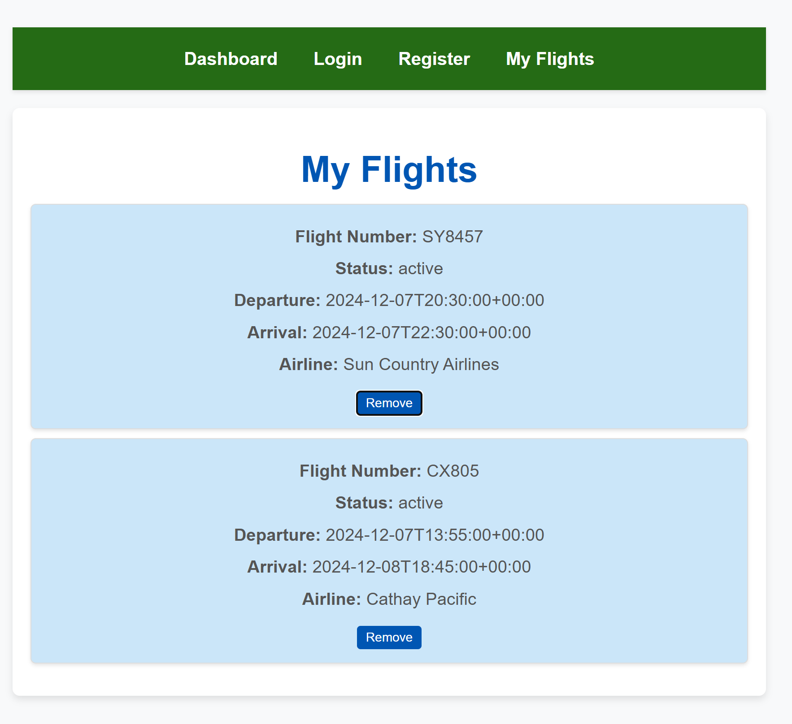

#**Flights Tracker**
A full-stack web application to track flights, manage personal flight lists, and provide real-time flight updates. This project features user authentication, flight tracking, and a personalized dashboard for users.

##Features
1. User Authentication: Register and log in to personalize your experience.
2. Flight Search: Search for flight details using flight numbers.
3. My Flights: Only logged-in users can access personalized features 
			- Add, view, and manage flights in a personal flight list.
4. Flight Tracking: Use mapping tools to display routes.
5. Backend API: Built with Node.js and MongoDB to handle all flight data and user authentication.

##Screenshots
- Dashboard

- Register Page

- Login

- My Flights

##Tech Stack
###Frontend
- React.js (with Vite)
- External CSS for styling

###Backend
- Node.js
- Express.js
- MongoDB

###Deployment
- Frontend: Deployed on Netlify
- Backend: Deployed on Render

##Setup Instructions
###Prerequisites
- Node.js (v16 or later)
- MongoDB Atlas Account or a local MongoDB server
- Netlify Account for frontend deployment
- Render Account for backend deployment

###Backend Setup
1. Clone the repository
2. Install dependencies: npm install
3. Create a .env file in the backend directory
4. Start the backend server: node app.js
The backend server will run on http://localhost:3000.

###Frontend Setup
1. Navigate to the frontend directory
2. Install dependencies: npm install
3. Create a .env file in the frontend directory
4. Start the development server: npm run development
The frontend application will run on http://localhost:5173.

##Usage Instructions
###1. Register a New Account
- Visit the /register page to create a new account.
- Provide a username, email, and password.

###2. Log In
- Use the /login page to log in with your credentials.
- After logging in, you’ll receive a JWT token stored in localStorage.

###3. Search for Flights
- Navigate to the /dashboard page.
- Enter a flight number and click “Search” to retrieve flight details.

###4. Add Flights to "My Flights"
- Logged-in users can add flights to their personalized flight list by clicking “Add to My Flights.”

###5. View and Manage My Flights
- Go to /my-flights to view your saved flights.
- Remove flights from your list or update them as needed.

##API Endpoints
###Public Endpoints
- **GET /api/public-flights?flightNumber={flightNumber}**
Fetch basic flight information for non-logged-in users.

###Protected Endpoints
-*POST /api/my-flights*
Add a flight to the authenticated user’s list.

-**GET /api/my-flights**
Retrieve the authenticated user’s saved flights.

-**DELETE /api/my-flights/:id**
Remove a flight from the user’s list.

##Deployment
###Deploying Backend
1. Push the backend code to GitHub.
2. Deploy it on Render:
	- Create a new Web Service and connect it to your GitHub repository.
	- Set the environment variables (MONGO_URI, JWT_SECRET, PORT) in the Render dashboard.

###Deploying Frontend
1. Push the frontend code to GitHub.
2. Deploy it on Netlify:
	- Link your GitHub repository.
	- Set the environment variable VITE_BACKEND_API_URL to your Render backend URL.

##Troubleshooting
- CORS Errors: Ensure your backend is configured to allow requests from the frontend domain.
- MongoDB Connection Issues: Double-check your MONGO_URI and ensure MongoDB Atlas allows access from your deployment environment.
